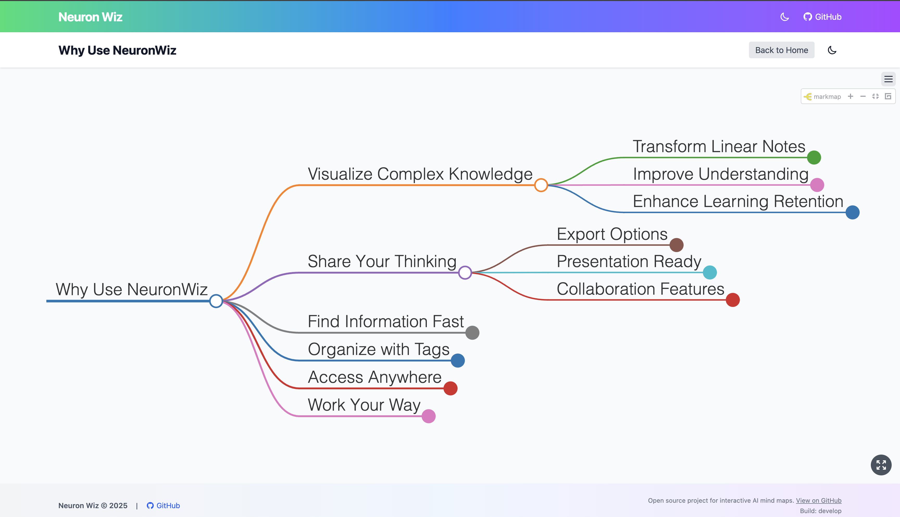

# Neuron Wiz 🧠



**Transform your knowledge into interactive visual mind maps**

Neuron Wiz turns your ideas, notes, and knowledge into beautiful, interactive mind maps that can be easily shared, searched, and explored. Perfect for visual learners, educators, researchers, and anyone who wants to organize information in a more intuitive way.


## ✨ Why Use Neuron Wiz?

- **Visualize Complex Knowledge** - Transform linear notes into interactive, expandable knowledge networks
- **Share Your Thinking** - Export and share your mind maps as SVG or PNG images
- **Find Information Fast** - Quickly search across all your mind maps to locate specific topics
- **Organize with Tags** - Categorize and filter your knowledge using a flexible tagging system
- **Access Anywhere** - Fully responsive design works on desktop, tablet, and mobile devices
- **Work Your Way** - Dark and light modes for comfortable viewing in any environment

## 🚀 Getting Started

Visit [https://neuronwiz.buildwizai.com](https://neuronwiz.buildwizai.com) to start exploring mind maps immediately!

### Exploring Mind Maps

1. **Browse** the homepage to see available mind maps organized by tags
2. **Search** using the search bar to find specific topics across all mind maps
3. **Click** on any mind map card to view it in detail
4. **Interact** by expanding/collapsing nodes, zooming in/out, and toggling full-screen view
5. **Export** your favorite mind maps as SVG or PNG files for presentations or sharing

### Keyboard Navigation

- `F`: Toggle full-screen mode
- `Esc`: Exit full-screen mode
- `Arrow Keys`: Navigate between nodes
- `Enter`/`Space`: Expand/collapse nodes
- `Ctrl+K`/`Cmd+K`: Focus the search bar

## 🔍 For Content Creators

Want to create your own mind maps with NeuronWiz? It's as simple as writing Markdown files:

```markdown
---
title: The Future of AI
description: Exploring emerging trends in artificial intelligence
tags: [AI, technology, future]
---

# The Future of AI

## Machine Learning Advancements
### Foundation Models
### Reinforcement Learning

## Ethical Considerations
### Bias Mitigation
### Safety Guidelines
```

Your Markdown file's structure automatically becomes the mind map's structure:
- Level 1 headings (`#`) become the central node
- Level 2 headings (`##`) become primary branches
- Level 3+ headings become deeper branches

Learn more about [creating your own mind maps](#for-developers) below.

## 🌐 For Publishers & Teams

NeuronWiz can be deployed as your organization's knowledge hub:

- **Interactive Documentation** - Make your technical documentation more engaging and easier to navigate
- **Knowledge Base** - Create an intuitive company knowledge base for better information discovery
- **Educational Content** - Develop interactive learning materials that engage visual learners
- **Research Organization** - Map research findings and connections between concepts

## 👩‍💻 For Developers

### Technical Requirements

- Node.js (v16+)
- npm or yarn

### Installation

```bash
# Clone the repository
git clone https://github.com/buildwizai/neuron-wiz.git
cd neuronwiz

# Install dependencies
npm install

# Generate the index file from markdown content
npm run gen-index

# Start the development server
npm run dev
```

### Building for Production

```bash
npm run build
```

The built site will be in the `dist` directory, ready for deployment.

### Adding Content

Add Markdown files to the `content/` directory with YAML frontmatter:

```markdown
---
title: Your Mind Map Title
description: A brief description of the mind map
tags: [tag1, tag2, tag3]
created: 2025-04-22T10:00:00Z
updated: 2025-04-22T10:00:00Z
---

# Root Node

## First Branch
### Sub-branch 1
### Sub-branch 2

## Second Branch
```

#### Required Frontmatter Fields

- `title`: The title of the mind map
- `description`: A brief description (shown in cards on the homepage)

#### Optional Frontmatter Fields

- `tags`: Array of tags for filtering and categorization
- `created`: Creation date in ISO format
- `updated`: Last update date in ISO format
- `slug`: Custom URL slug (defaults to a slugified version of the title)

## 🔧 Technical Details

This project follows web standards and best practices:

- **Accessibility**: WCAG 2.1 compliant with keyboard navigation and screen reader support
- **Performance**: Optimized loading with lazy-loaded components and code splitting
- **Security**: Content sanitization to prevent XSS attacks
- **Deployment**: Automated GitHub Actions workflow for continuous deployment

## 📄 License

MIT
