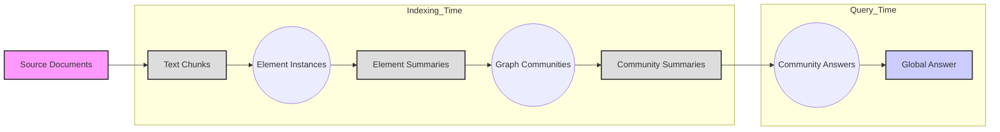

# Graph RAG Pipeline

The Graph RAG pipeline consists of several stages, which can be broadly categorized into **indexing time** and **query time**.

**Indexing Time**

*   **Source Documents → Text Chunks** {#text-chunks}: The process begins with source documents, which are split into text chunks. The size of these chunks is a key parameter, and it affects the number of LLM calls for extraction, as well as recall. Smaller chunks result in higher recall of entity references, as demonstrated in Figure 2, where a 600-token chunk size resulted in almost twice as many entity references as a 2400-token chunk size. The optimal chunk size balances recall and precision.
*   **Text Chunks → Element Instances** {#element-instances}: In this stage, an LLM identifies and extracts instances of graph nodes and edges from each text chunk. This includes identifying entities, their types, descriptions, and the relationships between clearly-related entities.  A multi-part LLM prompt is used that first identifies all entities in the text, including their name, type, and description, before identifying all relationships between clearly-related entities, including the source and target entities and a description of their relationship. The prompt can be tailored to the domain of the document corpus by using few-shot examples.  Additionally, a secondary extraction prompt can be used to extract covariates, such as claims linked to detected entities. To improve recall, multiple rounds of "gleanings" can be used to detect additional entities that might have been missed in previous extraction rounds.
*   **Element Instances → Element Summaries** {#element-summaries}: This stage uses an LLM to create abstractive summaries of the extracted elements (entities, relationships, and claims). This is a further round of summarization over matching groups of instances that converts instance-level summaries into descriptive text for each graph element.  The approach is resilient to variations in entity references, as community detection will group closely-related entities, and LLMs can understand different name variations for the same entity.
*   **Element Summaries → Graph Communities** {#graph-communities}: The graph is constructed by modeling the index as a weighted, undirected graph. Entity nodes are connected by relationship edges, with weights representing the normalized counts of detected relationship instances. A community detection algorithm, such as Leiden, is then used to partition the graph into communities of closely related nodes. Leiden is chosen for its ability to recover the hierarchical community structure of large-scale graphs efficiently.
*   **Graph Communities → Community Summaries** {#community-summaries}: Here, the LLM generates report-like summaries for each community in the Leiden hierarchy. These summaries are useful for understanding the global structure and semantics of the dataset, even without a specific query. For leaf-level communities, the element summaries are added to the LLM context window based on edge prominence. For higher-level communities, sub-community summaries can be substituted for longer element summaries to fit within the context window.

**Query Time**

*   **Community Summaries → Community Answers** {#community-answers}: Given a user query, the community summaries are used to generate intermediate answers. Community summaries are shuffled and divided into chunks to ensure that relevant information is distributed. The LLM generates intermediate answers in parallel, along with a score indicating the helpfulness of the answer. Answers with a score of 0 are filtered out.
*   **Community Answers → Global Answer** {#global-answer}: The intermediate community answers are sorted by their helpfulness scores and iteratively added to a context window until the token limit is reached. This context window is then used to generate the final global answer that is returned to the user.

The key components of this pipeline include: the **LLM-derived graph index**, which is central to the approach; **community detection**, which enables parallel summarization; **hierarchical summaries**, which enable multi-level exploration of data; and a **map-reduce approach**, for efficient processing of large text corpora.

