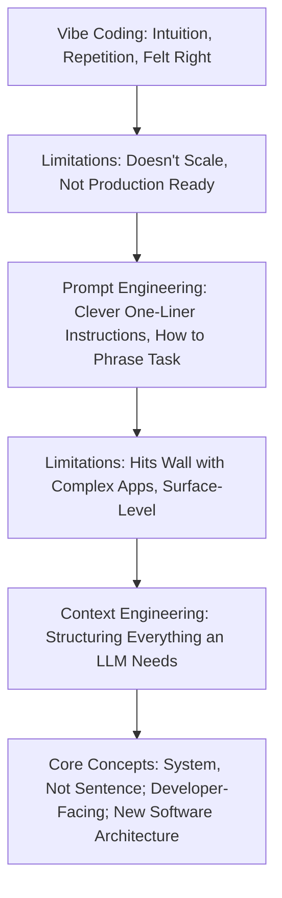
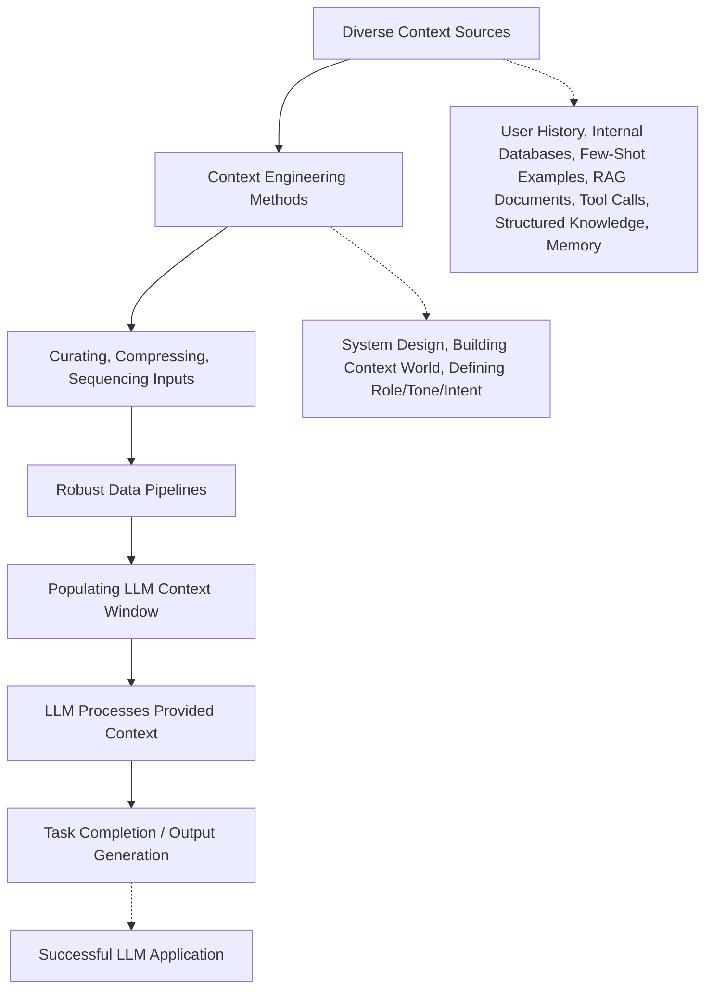
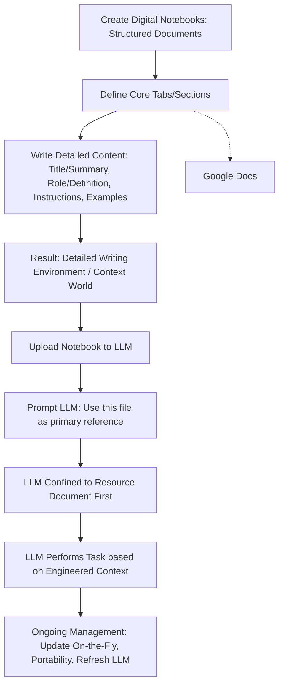

Context Engineering represents a significant evolution in working with Large Language Models (LLMs), moving beyond simple phrasing to comprehensive system design. It's fundamentally about **structuring everything an LLM needs to successfully complete a task**. This involves the **"delicate art and science of filling the context window with just the right information for the next step"**, ensuring the task is **"plausibly solvable by the LLM"** in the first place.

Here's a detailed breakdown of what Context Engineering entails and how it operates:

### What is Context Engineering?

*   **Definition**: It is the **art and science of structuring everything an LLM needs to complete a task successfully**. Andrej Karpathy, co-founder of OpenAI, emphasizes it as the "delicate art and science of filling the context window with just the right information for the next step" in industrial-strength LLM applications. Tobi Lütke, CEO of Shopify, defines it as "the art of providing all the context for the task to be plausibly solvable by the LLM".
*   **Beyond Prompt Engineering and Vibe Coding**:
    *   **Vibe Coding**, prevalent in the early days of LLM experimentation, relied on intuition and repetition, endlessly tweaking wording until it "felt right". However, intuition doesn't scale, whereas structure does, and what works in a playground often fails in production.
    *   **Prompt Engineering** typically involves "clever, (mostly) one-liner instructions". It focuses on *how to phrase* a task and is often associated with short task descriptions. It is described as being "for the moment" and specific input, where fine-tuning involves changing one word at a time. Prompting is considered "user-facing" and provides "form" or "surface".
    *   **Context Engineering** is considered "10x better than prompt engineering and 100x better than vibe coding". It represents a **structural shift**, not just semantic, moving from crafting a single sentence to **designing full systems**. It's primarily **developer-facing**. While prompt engineering provides "form," context "gives life" and "substance".

*   **Key Elements of Context**: Context Engineering involves curating, compressing, and sequencing the right inputs at the right time. The context window can be filled with a variety of information:
    *   **Task descriptions and explanations**
    *   **Few-shot examples**
    *   **Retrieval-augmented generation (RAG)** for relevant documents
    *   **Summarizing long conversations** to preserve state
    *   **Injecting structured knowledge**
    *   **Supplying tools** that allow the model to take action in the world
    *   **Memory, history, retrieval, and clean data**
    *   **Context from user history, prior interactions, tool calls, and internal databases**
    *   **Non-verbal cues** like tone, role, intent, embedded values, and downstream use

### How Context Engineering Works (Process & System Design)

Context Engineering is fundamentally about **building a robust system around the LLM** rather than just crafting a single prompt.

*   **Building Pipelines**: It requires **building data pipelines** that bring in context from various sources in a format that's easily digestible by a Transformer-based system.
*   **Systemic Approach**: It's described as "a system, not a sentence". When LLMs fail, it's often because the "system around it didn’t set it up for success," meaning the context was insufficient, disorganized, or wrong. LLMs, like humans, respond differently depending on how they are "talked to" – a poorly structured JSON blob might confuse a model where crisp natural language succeeds.
*   **Frameworks**: Frameworks like LangGraph are gaining traction because they give developers "fine-grained control over what goes into the model, what steps run beforehand, and where outputs are stored," embracing context engineering as central to any serious agent framework.
*   **Organizational Implications**: Beyond technical aspects, context engineering has organizational implications. It's about **encoding how a company operates**, including report structures, communication tone, and internal business logic. In this sense, it's "as much about culture as it is about code".
*   **New Software Paradigm**: It is "just one piece of a growing software stack built around LLMs," coexisting with problem decomposition, memory management, UI/UX flows, verification steps, and orchestrating multiple LLM calls. This is "not a wrapper" for ChatGPT, but a **"new paradigm of software altogether"**, ultimately being the **"new software architecture"**.

#### Example: Digital System Prompt Notebooks - No-Code Solution

One practical "no-code" approach to Context Engineering involves using "Digital System Prompt Notebooks".

*   **Creation**: These are structured documents (e.g., Google documents or any format the LLM accepts).
*   **Structure**: They typically have four core "tabs" or sections: **Title and Summary, Role and Definition, Instructions, and Examples**. More sections can be added, such as research or resources.
*   **Environment Building**: This process creates a **"detailed writing environment" for the LLM** to follow, essentially building a "context world" for the LLM. The key is to use "informationally dense word choices to cut out the fluff" to manage the context window efficiently.
*   **LLM Interaction**: After uploading the notebook to the LLM, the user **prompts the LLM to use this file as a primary source of reference** before using training or external data. This "confines the LLM to resource" the specific, built-in writing environment.
*   **Benefits**: These notebooks can be **updated on the fly**, are **portable across different LLMs**, and can be used to **"refresh" the LLM** if prompt drift is noticed, simply by recalling the file. It's akin to "building that Kung-Fu file so Neo can look at the camera and say 'I know Kung-Fu'".

***

Here are Mermaid diagrams to explain Context Engineering:

### 1. Evolution of LLM Interaction Paradigms

This diagram illustrates the progression from intuitive "vibe coding" to the structured "prompt engineering," and finally to the comprehensive "context engineering."

### 2. Context Engineering Process Flow

This diagram outlines the systematic steps involved in providing an LLM with the necessary context.

### 3. Digital System Prompt Notebooks - A Context Engineering Example

This diagram visualizes a specific, practical "no-code" method of implementing Context Engineering.

